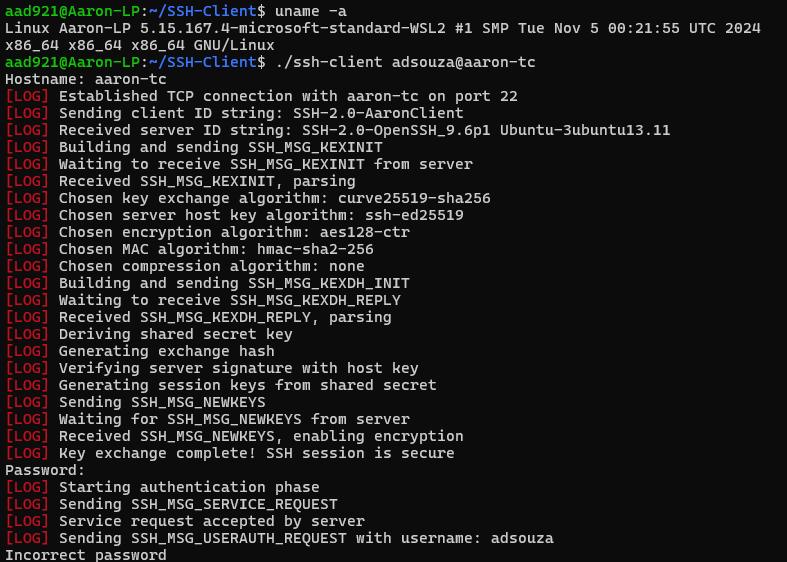
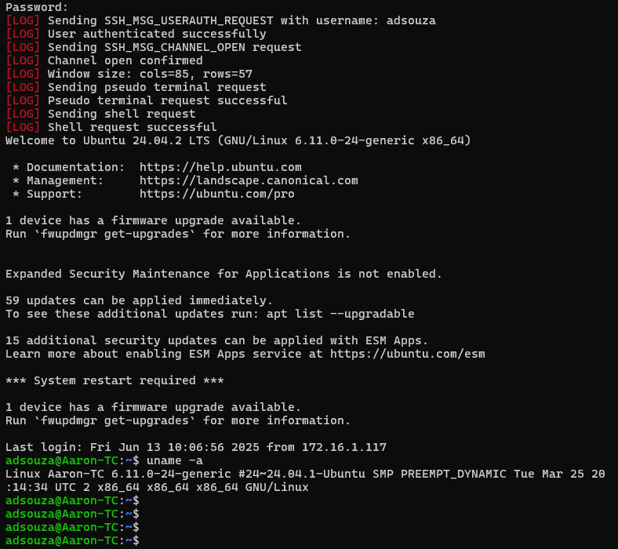

# Custom Multithreaded SSH Client
A fully custom SSH client developed from scratch in C++20, implementing all aspects of the SSH protocol from the ground up using raw sockets, cryptographic primitives, POSIX threads, and raw terminal I/O.

## Features
- Implements core SSH protocol (RFC 4253)
  - Algorithm Negotiation
  - Key Exchange
  - Encryption/Decryption
  - Secure Channel setup
  - Interactive shell session
- POSIX raw sockets for TCP/IP communication over port 22
- Cryptographic operations using OpenSSL 3.0
- Multithreaded architecture with POSIX threads to ensure a smooth user experience
- Raw terminal mode for seamless interactive shell experience
- Packet-level data management
- Minimal external dependencies

## Supported Algorithms
### Key Exchange (KEX)
- ```curve25519-sha256```
- ```diffie-hellman-group14-sha256```
### Public Key Algorithms
- ```ssh-ed25519```
- ```rsa-sha2-256```
### Encryption
- ```aes128-ctr```
- ```aes256-ctr```
### Message Authentication Code (MAC)
- ```hmac-sha2-256```
- ```hmac-sha1```
### Compression
- ```none```

## Demo
### Connection
<p>
  
  
</p>

### Wireshark Capture


## Build and Run
### Dependencies
- g++ with C++20 support
- OpenSSL 3.0 (libcrypto)
- POSIX threads (libpthread)

### Build
```bash
# Clone the repository
git clone https://github.com/adsouza7/SSH-Client.git
cd SSH-Client/

# Normal build
make

# Verbose build (with logs)
make verbose
```

### Run
```bash
# Run this command
./ssh-client <username>@<hostname>
```

## References
- [RFC 4253 - SSH Transport Layer Protocol](https://datatracker.ietf.org/doc/html/rfc4253)
- [RFC 4251 - SSH Protocol Architecture](https://datatracker.ietf.org/doc/html/rfc4251)
- [SSH Message Numbers](https://www.iana.org/assignments/ssh-parameters/ssh-parameters.xhtml)
- [SSH Connection Process](https://www.cisco.com/c/en/us/support/docs/security-vpn/secure-shell-ssh/222335-understand-secure-shell-packet-exchange.html)
- [POSIX Threads Documentation](https://pubs.opengroup.org/onlinepubs/7908799/xsh/pthread.h.html)
- [OpenSSL Documentation](https://docs.openssl.org/master/man7/ossl-guide-libcrypto-introduction/)

